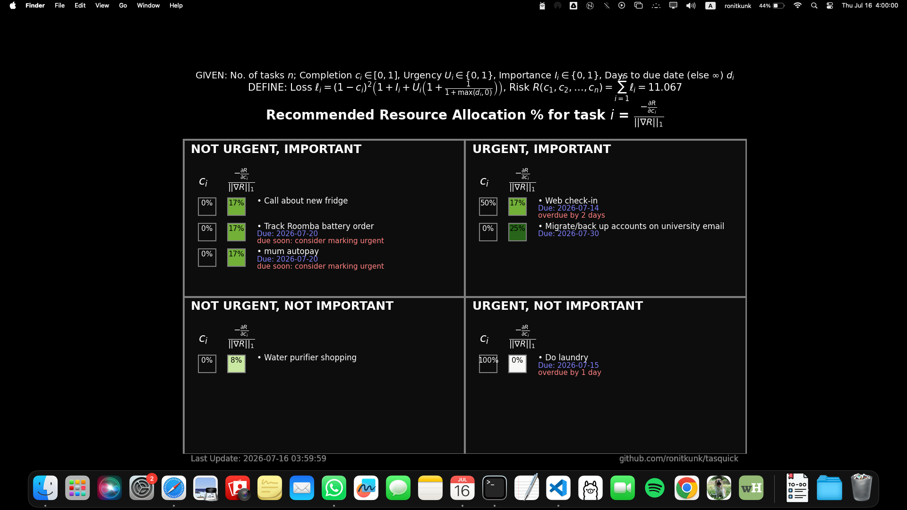

# tasquick

Upgrade your Mac wallpaper to an Eisenhower Matrix created in real-time from a list of your tasks.



## Usage
- Clone this repo
```sh
git clone github.com/ronitkunk/tasquick
```
- Install dependencies
```sh
pip install pillow pyyaml
```
- Create a YAML containing your tasks anywhere on your computer
    - Recommended: pin the YAML to your dock for easy edit access, or make a shortcut to it
```yaml
- name: Call about new fridge
  important: true
  urgent: false
  added_date: 2026-07-15

- name: Track Roomba battery order
  important: true
  urgent: false
  added_date: 2026-07-15
  due_date: 2026-07-16

- name: Migrate/back up accounts on university email
  important: true
  urgent: true
  added_date: 2026-07-15
  due_date: 2026-07-15

- name: Web check-in
  important: true
  urgent: true
  added_date: 2026-07-14
  due_date: 2026-07-14

- name: Do laundry
  important: false
  urgent: true
  added_date: 2026-07-15
  due_date: 2026-07-15

- name: Water purifier shopping
  important: false
  urgent: false
  added_date: 2026-07-15
```

- From the repo root, run main.py on the YAML to begin wallpaper updates
    - It is recommended to run this in a `tmux` pane to prevent accidental termination
    - Replace `PATH_TO_YOUR_YAML` with the path, for example, `python main.py tasks.yaml`
```sh
python main.py PATH_TO_YOUR_YAML
```

## Pointers
- Tasks will always go into the quadrant defined by the `important` and `urgent` booleans; however, the programme may recommend a different quadrant in the following instances:
    - if a task has a due date in $\leq 7$ days from the current date but is marked not urgent, a warning will recommend flagging it as urgent
    - if a task has no due date but is marked urgent, a warning will recommend adding a due date
    - if a task is overdue, a warning is shown
- The display is refreshed approximately every 15 seconds by default. This can be configured using the macro `LOOP_INTERVAL_SECONDS` in `main.py`

## Testing
It worked for me. Use at your own risk.

## Contribution
Just make your own fork. See licence.

## Declaration: AI use
The code in this repository was written with the assistance of LLMs.